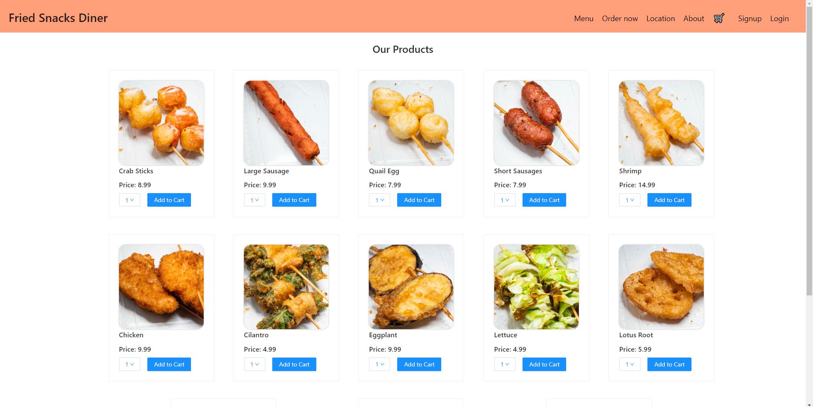

# Taiwanese Street

## Description

Come one, come all! Come taste taiwanese style street food from my friend's homecooked goods. Taiwanese Street is the internet store front for Fried Snacks Diner, who sells fried skeweers, much like the ones that someone would find in a taiwanese street market. Taiwanese Street is complete with the ability to make a cart and checkout with Stripe.

## Table of Contents
* [Installation](#usage)
* [License](#license)
* [Questions](#questions)

## Usage
Simply navigate to the website below
https://evening-fjord-88647.herokuapp.com/

## License
This project is covered under the MIT license.
[Click here to see the terms of the license](https://choosealicense.com/licenses/mit/)
## Questions
Any questions or concerns?
Contact us on our github: 

[adambedingfield](https://github.com/adambedingfield)

[albertjly](https://github.com/albertjly/)

[blazelim](https://github.com/blazelim/)

Or email us at: 

adamcbedingfield@gmail.com

albertjly@gmail.com

blazebentleycolim@gmail.com 
